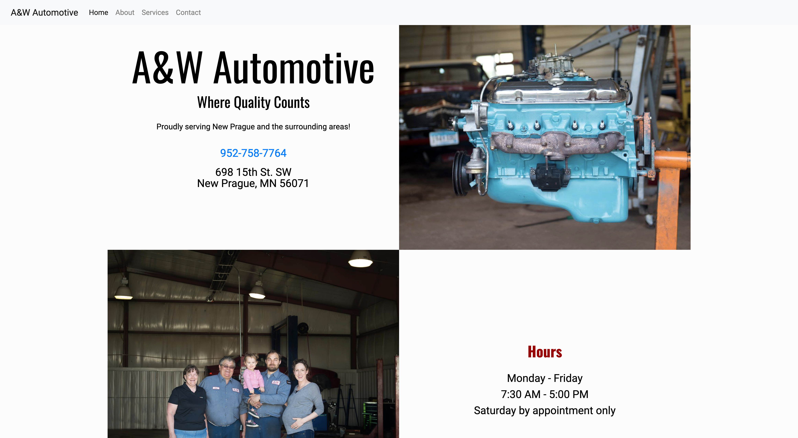

  <h1 align="center">A&W Automotive</h1>
  
<a href="https://awauto.jakesimmens.com" target="_blank" rel="noopener noreferrer">Visit Site</a>

<!-- TABLE OF CONTENTS -->

  
Table of Contents

  <ol>
    <li>
      <a href="#about-the-project">About The Project</a>
      <ul>
        <li><a href="#built-with">Built With</a></li>
      </ul>
    </li>
    <li><a href="#contact">Contact</a></li>
    <li><a href="#acknowledgements">Acknowledgements</a></li>
  </ol>

<!-- ABOUT THE PROJECT -->
## About The Project

This website was put together for a local auto repair shop.  The basic project was taking the customer's current static webpage and giving it a rework and face lift.  Two seperate web pages were created.  The first focused on using flexbox and the second go around implemented Bootstrap 4.  The Bootstrap project was able to give the site a little bit more of a shine.

### Built With

* [Bootstrap 4](https://getbootstrap.com)
* [Node.js](https://nodejs.org)
* [Express](https://expressjs.com)

<!-- USAGE EXAMPLES -->
## Usage

Use this space to show useful examples of how a project can be used. Additional screenshots, code examples and demos work well in this space. You may also link to more resources.

_For more examples, please refer to the [Documentation](https://example.com)_

<!-- CONTACT -->
## Contact

Jake Simmens - [LinkedIn](https://linkedin.com/in/jakesimmens) - jake@jakesimmens.com

<!--Project Link: [http://jakesimmens.com](http://jakesimmens.com) -->

<!-- ACKNOWLEDGEMENTS -->
## Acknowledgements
* [Othneil Drew](https://github.com/othneildrew/Best-README-Template) - Readme template

<!-- MARKDOWN LINKS & IMAGES -->
<!-- https://www.markdownguide.org/basic-syntax/#reference-style-links -->
[contributors-shield]: https://img.shields.io/github/contributors/othneildrew/Best-README-Template.svg?style=for-the-badge
[contributors-url]: https://github.com/othneildrew/Best-README-Template/graphs/contributors
[forks-shield]: https://img.shields.io/github/forks/othneildrew/Best-README-Template.svg?style=for-the-badge
[forks-url]: https://github.com/othneildrew/Best-README-Template/network/members
[stars-shield]: https://img.shields.io/github/stars/othneildrew/Best-README-Template.svg?style=for-the-badge
[stars-url]: https://github.com/othneildrew/Best-README-Template/stargazers
[issues-shield]: https://img.shields.io/github/issues/othneildrew/Best-README-Template.svg?style=for-the-badge
[issues-url]: https://github.com/othneildrew/Best-README-Template/issues
[license-shield]: https://img.shields.io/github/license/othneildrew/Best-README-Template.svg?style=for-the-badge
[license-url]: https://github.com/othneildrew/Best-README-Template/blob/master/LICENSE.txt
[linkedin-shield]: https://img.shields.io/badge/-LinkedIn-black.svg?style=for-the-badge&logo=linkedin&colorB=555
[linkedin-url]: https://linkedin.com/in/othneildrew
[product-screenshot]: images/screenshot.png
